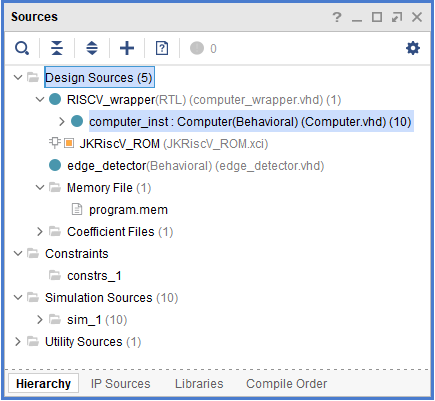
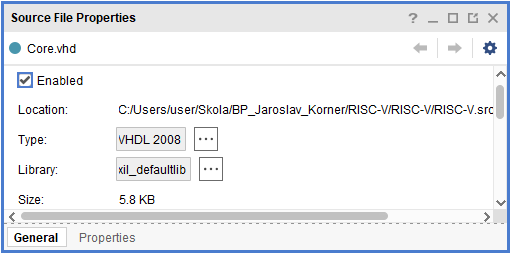
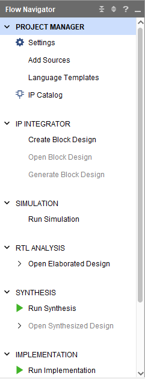
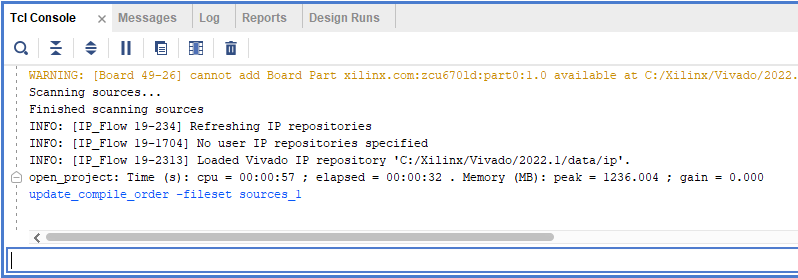

# Technická dokumentace

### Struktura repositáře
```Bash
$ tree -d -L 4
├── assets
├── DOC
│   └── official
├── programs
└── RISC-V
    ├── RISC-V.gen
    │   └── sources_1
    │       └── ip
    ├── RISC-V.ip_user_files
    │   ├── ip
    │   ├── ipstatic
    │   ├── mem_init_files
    │   └── sim_scripts
    ├── RISC-V.runs
    │   └── synth_1
    ├── RISC-V.sim
    │   └── sim_1
    │       └── synth
    └── RISC-V.srcs
        ├── sim_1
        │   └── new
        └── sources_1
            ├── ip
            └── new
```
Obsahuje adresářů:
- `RISC-V/`  - projekt IDE Vivado
- `programs/` - programy pro otestování procesoru a přiložené scripty
- `RISC-V.srcs/sources_1/new` - *.VHD* zdrojové soubory 
- `RISC-V.srcs/sim_1/new` - testovací soubory pro simulace

### Slovníček
| Anglicismus | Český ekvivalent |
| --- | --- |
| kompilace | překlad |
| kompilátor | překladač |
| test banch | testová sestava |


## Seznam zkratek
IDE
HW
GUI

## Krátký průvodce IDE Vivado

### Ikony ovládání okna

- Help
- Minimize
- Maximize - zvětší okno na úrovni editoru
- Float - odpojí okno z editoru a umožní jeho volné umístění
- Close - okno na dobro zavře

### Sources
Okno sources zobrazuje přehled projektu jako strukturu adresářů. Základní dělení je na:
- Design Sources, zde jsou umístěny všechny ".vhd" soubory s definicí nárhu.
- Constrains
- Simulation Sources, zde jsou soubory *test banch* pro simulaci
- Utility Sources



### Vlastnosti souborů
V okně vlastností souborů je možné měnit parametry souboru. Typ slouží k nastavení v jaké revizi jazyka VHDL je soubor napsaný.



### Flow Navigator
Umožnuje ovládat nástroje jednotlivých fází vývoje. 
- Elaborated Design
Generuje návrh z ".vhd" souborů popisujících HW. Před generováním designu je potřeba nejprve zvolit *Top design*, v okně **Source** klikněte pravým na soubor zdrojového kódu návrhu a zvolte **Set as Top**. 
- Simulation
Spouští simulaci souborů *test banch*, ten je zapotřebí vybrat jako *Top design*, v okně **Source** klikněte pravým na soubor zdrojového kódu simulace a zvolte **Set as Top**.



### Tcl Console
Okno konzole "tickle" najdete v dolní části IDE. Základní vlastnost IDE je překlad operací GUI na příkazy konzole tcl skriptu, pokročilejší uživatel se může částečně oprostit od grafického ovládání ve prospěch přesných příkazů konzole.



## Spuštění simulace
Okno simulace
Scope
Přidání sledovaného signálu
Okno simulace:
- Zoom in
- Zoom out
- Zoom fit
Scrolovaní myší

Ovládání simulace
Debugování
F8

Restartování simulace
Klikněte pravým tlačítkem myši na odrážku:
**SIMULATION** ->**Close simulation**

## Testování
Pro otestování návrhu je připraveno několik fází:

### 1. Testování blokového návrhu
Pro otestování základních bloků návrhu jsou připravené test banch. Ty se nacházejí v adresáři: `RISC-V.srcs/sim_1/new`. Testy využívají kombinace příkazů `assert` a `report` pro vypisování hlášení v případě že nějaký z testovacích příkladů selhal. Po provedení všech testů se do konzole vypíše hláška *Done* do Tcl Console.

- tb_ALU_control
Tento test slouží pro ověření zda fungují jednotlivé funkce na ALU. Při selhání operace vypíše o který test šlo.
- 

### 2. Testovací programy v simulaci
TODO: 

### 3. Spuštění demonstračního programu na desce

#### 0. Nahrání programu na SD kartu
1. Zformátujte SD kartu na formát *fat32*.
	- Můžete použít nástroj: [SD Card Formatter](https://www.sdcard.org/downloads/formatter/sd-memory-card-formatter-for-windows-download/).
2. Připravte si program.
	- Lze použít buď některý z programů v adresáři: *progams*.
	- Nebo můžete napsat vlastní program (dále v sekci Otestování vlastního programu před spuštěním).
3. Přeložte program.
	1. K překladu lze využít například online překladač z  [[6. semestr/PDO-Psani_technicke_dokumentace/README#Překlad zdrojových kódů|Překlad zdrojových kódů]].
	2. Hexdump uložte do souboru s příponou *.txt*.
1. Vytvořte program ve formátu *.raw*.
	- Použijte program *vivado_datafile_generator.py* pro vygenerování *.raw* souboru.
1. Nahrajte *.raw* soubor na předem připravenou SD kartu.

#### 1. Xilinx Vivado:
1. Otevřít: Wraper projekt
2. Otevřít blokový design
Show ip status
upgrade selected

3. Vygenerujte bitstream
PROGRAM AND DEBUG -> Generate Bitsream
Design runs (průběh)

4. Exportovat bitstream:
File -> export -> hardware
Include bitstream

#### 2. Xilinx Vitis:
Vyberte cestu k adresáři: **RISCvonZED**
Zelený je projekt
Zbuildovat: strl+b (nebo kladívkem)

#### 3. Připojení desky
1. Ve správci zařízení zjistěte jaké zařízení sériové linky vede vývojovou desku. V mém případě šlo o port `COM4`.
2. Spusťte aplikaci pro komunikaci po seriové lince, například `Putty`.
	 - Nastavte port: `COM4`
	 - Rychlost komunikace: `115200`
	 - Případně nastavte logování komunikace.
3. 

**debug** -> **debug**
F5 - step in
F6 - step over
F8 - run until

disconect

tlačítka:
prog - naprogramuj FPG z SD 
rst - reset ARMU

Když zmáčknu oboje, tak se to úspěšně restartuje

F3 - místo implementace kódu

cltr + alt + r - refaktor
ctrl + shift + g - všechny výskyty
ctrl + shift + f - formatovat

## Nahrání jiného programu
Pro změnu programu v simulaci *tb_run_program.vhd* je potřeba změnit soubro: *program.mem*  přesunout jej do správného adresáře.

### 1. hex dump
Vzorové programy jsou připraveny v souborech *.txt* v adresáři: `RISC-V/programs/`. Pro překlad vlastního kódu lze například použít [[6. semestr/PDO-Psani_technicke_dokumentace/README#Překlad online|online překladač]].

### 2. Aktualizace .mem souboru
Python script `RISC-V/programs/vivado_datafile_generator.py` slouží pro přepis hex-dump souboru do formátu .coe:
```Bash
$ python3 .\vivado_datafile_generator.py -h    
usage: vivado_datafile_generator.py [-h] -i INPUT
                                    [-o OUTPUT] [-r RADIX]
                                    [-f FORMAT]

Aplication for generating COE and MEM file.

options:
  -h, --help            show this help message and exit   
  -i INPUT, --input INPUT
                        input file
  -o OUTPUT, --output OUTPUT
                        output file
  -r RADIX, --radix RADIX
                        radix
  -f FORMAT, --format FORMAT
                        file format
```
Pro vygenerování nového souboru *.mem* s obsahem paměti ze souboru *sum.txt* zadejte příkaz:
```Bash
python3 vivado_datafile_generator.py -i sum.txt -o program.mem
```

### 3. Nahraní nového programu do simulace
Test banch *tb_run_program.tb* spouští program uložený do souboru: *program.mem*. Pro spuštěné nového programu je potřeba výše vygenerovaný soubor přesunout do adresáře *./RISC-V.srcs/sources_1/new/* a restartovat simulaci.

Nyní již můžete spustit simulaci s novým programem. 

## Otestování vlastního programu před spuštěním 
Před nahráním vlastního programu je vhodné otestovat jeho funkčnost, k tomu lze využít některého ze simulátorů RISC-V:
- [riscfive: seznam simulátorů](https://www.riscfive.com/risc-v-simulators/)
- [Online: venus.kvakil](https://venus.kvakil.me)
- [Online: ascslab](https://ascslab.org/research/briscv/simulator/simulator.html)
- [VS Code rozšíření: venus](https://marketplace.visualstudio.com/items?itemName=hm.riscv-venus)

## Překlad zdrojových kódů

### Sestavení překladače
Podrobný postup je popsán na stránkách [repositáře](https://github.com/riscv-collab/riscv-gnu-toolchain). Zkrácený postup pro operační systémy Linux:

1. Naklonování repositáře s nástroji:
```bash
git clone https://github.com/riscv/riscv-gnu-toolchain
```

2. Instalace potřebných balíčků:
```bash
sudo apt-get install autoconf automake autotools-dev curl python3 libmpc-dev libmpfr-dev libgmp-dev gawk build-essential bison flex texinfo gperf libtool patchutils bc zlib1g-dev libexpat-dev ninja-build
```

3. Konfigurace před sestavením:
```bash
cd riscv-gnu-toolchain/
./configure --prefix=/opt/riscv --with-arch=rv32i --with-abi=ilp32
```
- `/opt/riscv` je cesta k adresáři kam se nástroj pro překlad sestaví
- `rv32i` je naše architektura
- `ilp32` je konfigurace pro architekturu bez jednotky s plavoucí řádovou čárkou

4. Sestavení nástroje:
```bash
make linux
```

5. Přidání nástroje do cesty spustitelných nástrojů:
```bash
export PATH="/opt/riscv/bin:$PATH"
```

6. Nyní je překladač připraven k použít a mělo by být možné jej spustit příkazem:
```bash
riscv32-unknown-elf-gcc <nazev_programu.c>
```

### C -> asm

#### Překlad online
Pro jednodušší programy je vhodné použít překlad online, pro který není potřeba na vlastní počítač nic instalovat. 

Překlad z C na asm RISC-V [compiler explorer](https://godbolt.org). Umožnuje překlad překlad z mnohých jazyků do asm pro různé platformy. Nás zajímá jazyk **C** na **RISC-V rv32gc clang (trunk)**. Instrukční sada rv32i je podmnožinou rv32gc a je tedy nutné mít na mysli, že ne všechny instrukce (například: násobení, FP operace) půjde po překladu spustit. 
V nastavení výstupu je vhodné zaškrtnout položky *Demangle identifiers* a odfiltrovat vše kromě *Comments*. 

#### Překlad na vašem stroji
Lze použít různých překladačů, například: Clang/LLVM nebo GCC.
- 64 bitová architektura

Kompilace zdrojových pro 64bitvůou architekturu mohou zajistit již sestavené nástroje od [sifive](https://github.com/sifive/freedom-tools/releases).

- 32 bitů

Naše architektura je však 32bitová a proto si musíme sestavit vlastní překladač. Překlad gcc pro křížový překlad [[6. semestr/PDO-Psani_technicke_dokumentace/README#Sestavení překladače|zde]]. Tutoriál [zde](https://www.youtube.com/watch?v=sPvMXGFTC2U).
https://five-embeddev.com/toolchain/2019/06/26/gcc-targets/

Kompilace zdrojového kódu programu:
- Překlad v jednom kroku:
```bash
riscv32-unknown-elf-gcc fibonaci_rekurze.c -o fib.bin
```
- Překlad a slinkování postupně:
```bash
riscv32-unknown-elf-gcc -c -o fib.o fibonaci_rekurze.c
riscv32-unknown-elf-gcc -g -o fib.bin fib.o
```

#### Disassembly
Překlad programu do binárního souboru:
```bash
riscv32-unknown-elf-gcc -c -o code.o sum.c
```
- *sum.c* vzorový program k překladu.
- `-o` nastavuje název výstupního souboru na *code.o*.
- `-c` kód pouze přeloží

Přepis binárního kódu do assembly:
```bash
riscv32-unknown-elf-objdump -d code.o
```


### asm -> hexa
#### Překlad online
Překladač z asm na hexa RISC-V překladač: [riscvasm.lucasteske](https://riscvasm.lucasteske.dev/#).
Na ovládání velmi jednoduchý překladač. Po vložení asm kódu stačí zmáčknout "BUILD" a kód se přeloží do hexa souboru. Poskytuje i disasembly výstup pro zpětný přepis, který obsahuje již i čísla adres v paměti vizualizující jednotlivé skoky na návěští.


#### Překlad na vašem stroji
TODO

### HexDump
Pro otevření *.bin* souborů lze použít programů typu hexdump.

- Windows [free hex editor](https://www.hhdsoftware.com/free-hex-editor)
- Linux [hexdump](https://manpages.ubuntu.com/manpages/bionic/en/man1/hexdump.1.html)


## Zdroje:
- https://stackoverflow.com/questions/74231514/how-to-install-riscv32-unknown-elf-gcc-on-debian-based-linuxes
- https://stackoverflow.com/questions/31390127/how-can-i-compile-c-code-to-get-a-bare-metal-skeleton-of-a-minimal-risc-v-assemb
- https://web.eecs.utk.edu/~smarz1/courses/ece356/notes/assembly/


