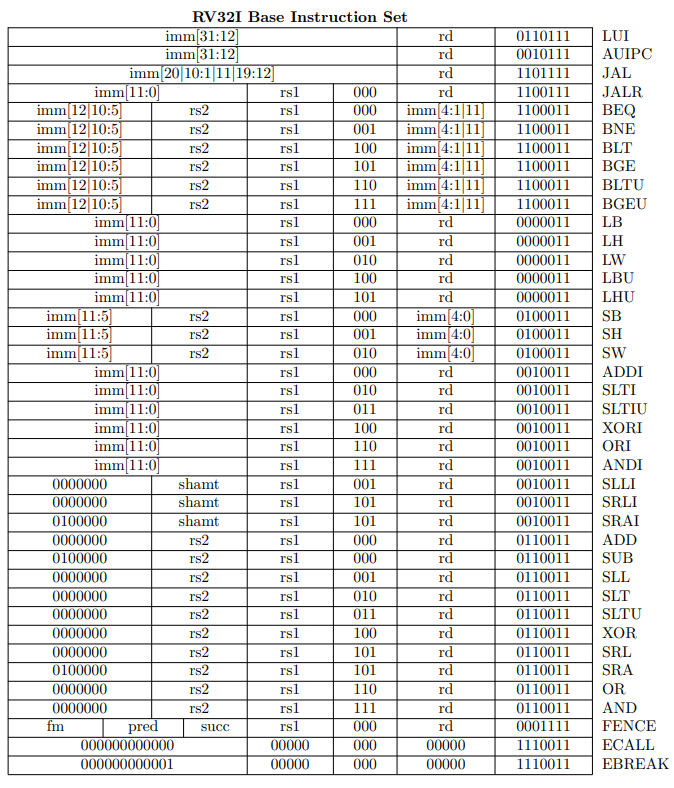
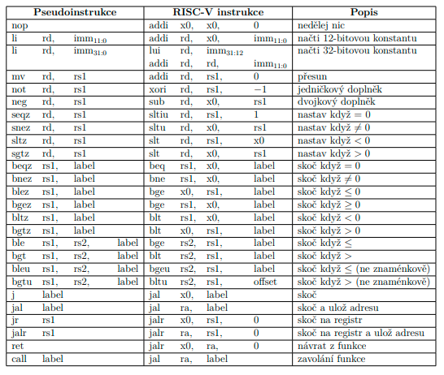

# Programování procesorů RISC-V v assembly
V následujících kapitolách se nejprve lehce seznámíme s psaním programů v jazyce assembly pro procesory RISC-V.

## Instrukce
Na obrázku je přehled všech instrukcí implementovaných procesorem.



## Pseudoinstrukce
Pseudoinstrukce slouží pro větší abstrakci při programování v jazyce symbolických adres (assembly). Umožňují psát program v instrukcích, které procesor sice přímo nepodporuje, ale jejich vykonání je možné syntetizovat pomocí již existujících instrukcí a to buď zaměněním pořadí argumentů, či případně vynulováním jednoho z nich. 

Například instrukce MV (přesun obsah registru) jde syntetizovat jako `ADDI rd, ra1, 0|`. 



V tabulce je přehled dalších pseudoinstrukcí. 

## Zápis instrukcí v jazyce symbolických adres
Instrukce se skládá z názvu instrukce a argumentů. Argumenty jsou odděleny čárkou a mohou být v závorce. Argumenty mohou být indexy registrů, konstanty, nebo adresy do paměti. 

```asm
inst rd, rs1, rs2
inst rd, rs1, imm
jmp rd, imm
```

Jak je vyobrazeno v kódu, pořadí argumentů je následující: cílový registr, první zdrojový registr, druhý zdrojový registr. Pokud je v instrukci pouze jeden registr, tak je to cílový registr. 

\subsection{Inicializace procesoru}
Procesor je potřeba před spuštěním vyresetovat. To smaže obsah všech registrů a shodí všechny případné výjimky. Pokud náš program pracuje se zásobníkem, tak je potřeba nejprve provést inicializaci registru \verb|x2| (\verb|sp|\index{sp} - stack pointeru) na horní hranici rozsahu paměti RAM\index{RAM}, příklad kódu \ref{listing:asm_init}. Operační paměť má nastavenou syntetizovanou velikost 4kB (4096 bajtů).

```asm
# MEM(0:4092)
# WORD_SIZE = 4
li sp, 4096
addi sp, sp, -4
```

## Volání funkcí
Volání funkcí v jazyce symbolických adres je znázorněno v kódu \ref{listing:asm_func}. Symbol \verb|func| je zde použit pro název funkce a používá se jako reference na adresu následující instrukce.

```asm
func:
    # tělo funkce
    ret

jal ra, func
```

Příkaz `jal` (jump and link) provede skok na adresu funkce a uloží si do registru `ra` adresu následující instrukce. Tento registr se používá pro návrat z funkce. Příkaz `ret` (return) provede skok na adresu uloženou v registru `ra`. Jako registry argumentů se standardně používají registry `a0` až `a7`. Pro uložení návratových hodnot slouží registry `a0` a `a1`.

## Začínáme ve funkci main
Je možné, že náš program po inicializaci registrů obsahuje deklarace funkcí, které chceme při spuštění přeskočit. Skok na hlavní program vykoná instrukce: `j main`. Příkaz `j` (jump) provede skok na adresu funkce (main). 

## Program v Assembly

Takto by mohl vypadat demonstrační program, který běží v nekonečné smyčce. Funkce `return_arg` vrací svůj argument. Program main, volá funkci `return_arg` a ta svůj argument `a0` ukládá jako návratovou hodnotu do registru `a1`. Pokud je návratová hodnota různá od nuly, tak se program vrátí na začátek smyčky `loop`. Pokud je návratová hodnota nula, tak se program ukončí vyvoláním výjimky instrukcí ECALL.

```asm
.text
.globl main

# inicializace ukazatele na zasobnik
li sp, 4096         # MEM(0:4092)
addi sp, sp, -4     # WORD_SIZE = 4

j main              # skok na smycku hlavni funkce

# Funkce: return argumet
# Argumenty:
#  a0 - argument
#  a1 - navratova hodnota
return_arg:
    mv a1, a0       # a1 = a0
    li a0, 0        # a0 = 0
    ret

main:
    addi a0, x0, 1  # a0 = 1

    loop:
        jal ra, return_arg  # a1 = return_arg(a0)
        addi a0, a1, 0      # a0 = a1
        bne a1, x0, loop    # if a1 is True goto loop
    ecall
```

Direktiva `.text` říká, že následující příkazy jsou instrukce programu a budou uložena v sekci paměti **text**. Direktiva `.globl` nastavuje následující symbol jako globální, ten pak může být použit i v jiných souborech. V tomto případě je to symbol `main`.