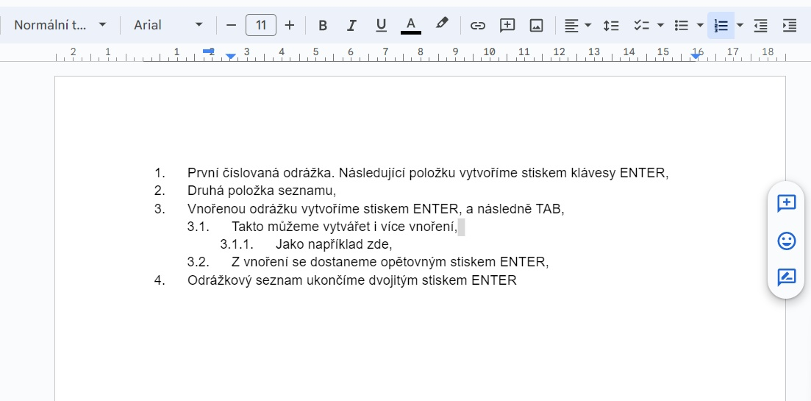

# Jak psát číslované odrážkové seznamy

V online aplikaci [Google dokumenty](https://docs.google.com/document)

## Než začnete

1. Otevřete webový prohlížeč (např Edge, Mozilla, Chrome, ...).
2. Do vyhledávacího okna zadejte "Google dokumenty", nebo klikněte na odkaz [zde](https://docs.google.com/document/u/0/).
3. Na stránce Doogle dokmentů otevřete nový dokument ikonou "+", jako je naznačeno na obrázku níže.

## Seznámení se rozhraním

### Panel záložek
Poskytuje pokročilé možnosti práce s dokumentem.

### Panel nástrojů
Obsahuje nejčastěji používané nástroje pro práci s dokumentem. 

V předposlední sekci se nalézají ikony práce s odrážkami. Zde vás zajímá ikona číslovaného seznamu. Kliknutím na šipku dolů se zobrazí rozbalovací seznam stylů odrážek. Zde vyberte třetí možnost (plně číslovanné odrážky). Provedením výběru se vloží první odrážka nového seznamu, a textový editor nás vrátí na původní pozici kurzoru v dokumentu. 

## Číslované odrážky

Teď si vyzkoušejte tvorbu seznamu podle následující ukázky.

Nebojte se experimentovat, pokud se něco nezadaří vraťte se o krok zpět, uvidíte, že za chvíli budete psát odrážkové seznamy jako mistr. 

