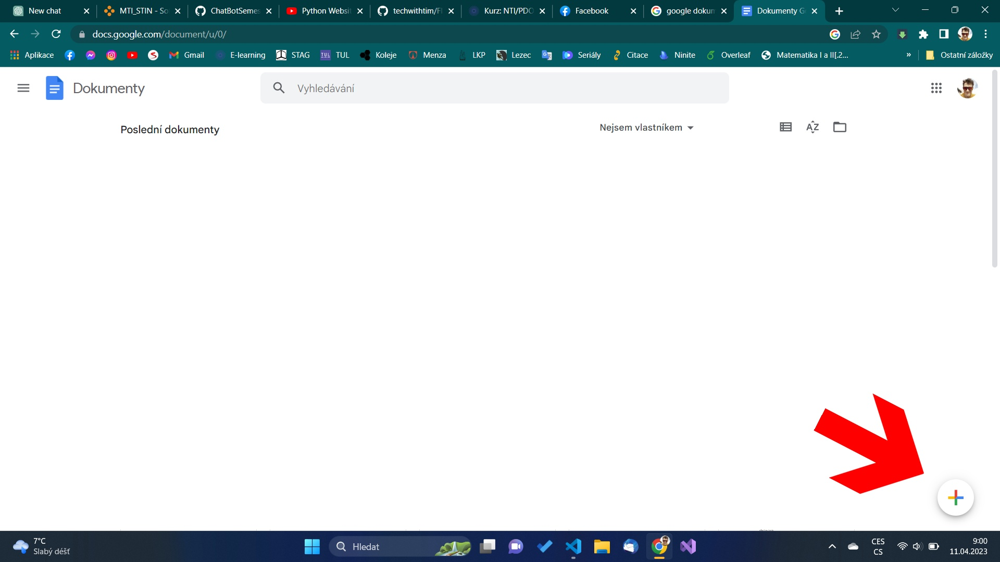
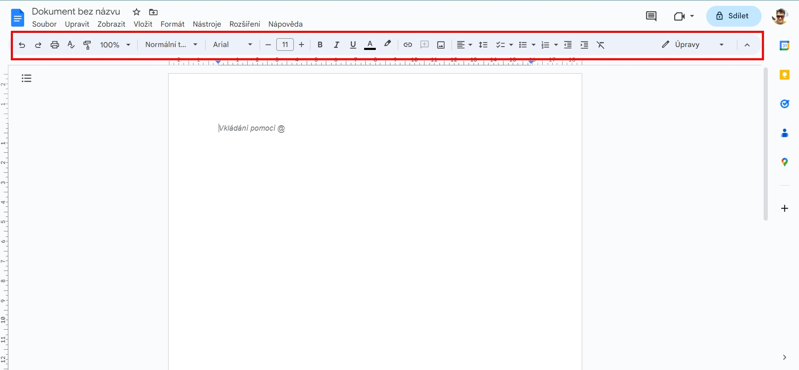
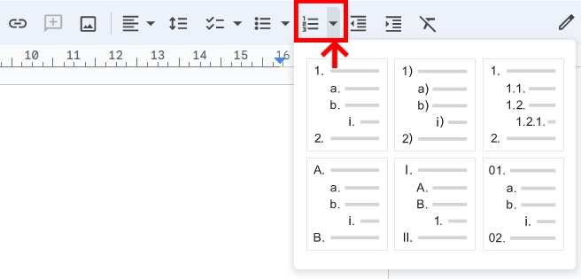

# Jak psát odrážkové seznamy

TODO: vkládat obrázky relativní cestou

V online aplikaci [Google dokumenty](https://docs.google.com/document)

## Než začnete

1. Otevřete webový prohlížeč (např Edge, Mozilla, Chrome, ...).
2. Do vyhledávacího okna zadejte "Google dokumenty", nebo klikněte na odkaz [zde](https://docs.google.com/document/u/0/).
3. Na stránce Doogle dokmentů otevřete nový dokument ikonou "+", jako je naznačeno na obrázku níže.

## Seznámení se rozhraním

### Panel záložek
Poskytuje pokročilé možnosti práce s dokumentem.

### Panel nástrojů
Obsahuje nejčastěji používané nástroje pro práci s dokumentem. 

V předposlední sekci se nalézají ikony práce s odrážky.

Rozbalovací seznam s variantami stylů odrážek.

## Číslované odrážky

1. Výběr odrážkového seznamu dle vaší preference stylu
Najeďte myší na ikonu číslovaného seznamu a klikněte levým tlačítkem myši na malou šipku dolů a v rozbalovacím seznamu si vyberte požadovaný styl. Po zvolení stylu se vám vloží první odrážky nového seznamu.

Vyzkoušejte si a za chvíli byte psát odrážkové seznamy jako mistr. 

