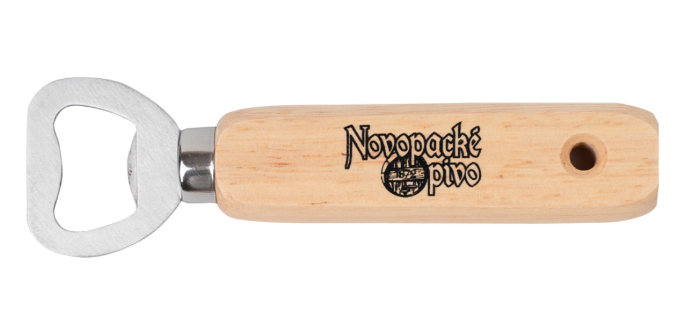
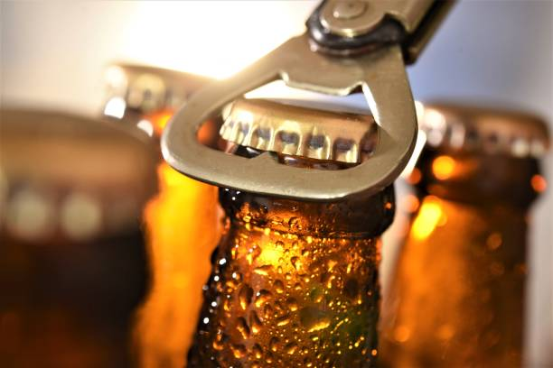

# Otvírák na pivo

Představte si, že píšeme dokumentaci k otvíráku na pivo.
-   [x] Vytvořte dvojice.

1.  Zkuste napsat "koncept".
2.  Zkuste napsat pracovní postup pro otevření piva.
3.  Zkuste napsat referenci.
4.  Zkuste udělat katalogový list.
5.  Zkuste napsat tutoriál. 

## Obrázek

## Koncept

Otvírák na pivo je nástroj, který slouží k otevření piva.

## Pracovní postup
**!** Ujistěte se že vaše lahvové pivo disponuje kovovým víčkem.

**!** Zkontrolujte, aby Váš otvírák nebyl poškozen.

1.  Uchopte otvírák za madlo
2.  Vezmete si pivo do druhé ruky
3.  Přiložte kovovou část otvíráku na vičko piva
4.  Pozvolným tažením otvíráku směrem nahoru otevřete pivo
5.  Pivo je otevřeno - konzumujte, dobrou chuť

## Referenční manuál
1. Madlo - slouží k uchopení otvíráku
2. Kovová část - slouží k otevření piva

## Katalogový list

### Materiály

-   Kov
-   Dřevo

### Skladování

-   Pro optimální životnost skladujte v suchu (při skladování v mokru může dojít k korozí kovové části)

- Nevystavujte ohni (hrozí poškození dřevěné části)

