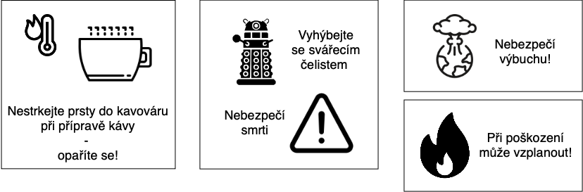

# Výstrahy a varování

1. Kávovar - varování
- Nestrkejte prsty do prostoru kelímku při přípravě kávy, opaříte se!
- Při polití kávou z kelímku může dojít k popálení!

2. Svářecí robot - varování, upozornění
Svařování elektrickým obloukem
- vyhýbejte se svářecím čelistem, hrozí nebezpečí smrti!

3. Mobil - varování
- při poškození může vzplanout!

## Obrázky

